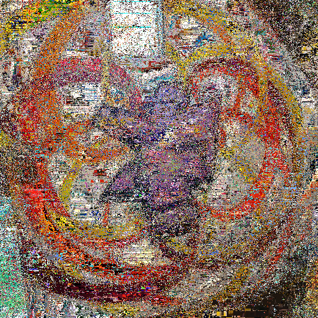

# Plingo

_An image says more than 1.000 commands_

## Introduction

**Plingo** is a programming language made for pixel-based image manipulation. Its main goal is to omit writing text based code so it uses the image itself as the program.

Each pixel of the inpupt image is a command with up to two parameters. Each command gets executed and thereby modifies a copy of the image creating a new image. So the source image is the input data and the code ifself.

### Example
| Input                                       | Output                                                     |
|---------------------------------------------|------------------------------------------------------------|
|  |  |
|          |          |

## Execution

Running `plingo example.png` will execute example.png and create the resulting image example.png._out.png

## Command generation

Each pixel of the input is seperated into its RGB values (aka channels). One channel is used for the main command (the exact channel is defined by the `Command Pointer`).
The other two channels are used as parameter values for the command to be called.

Values are kept in range by using the modulo operator.

## List of commands

For a full list of commands see [docs/api.md](docs/api.md)
